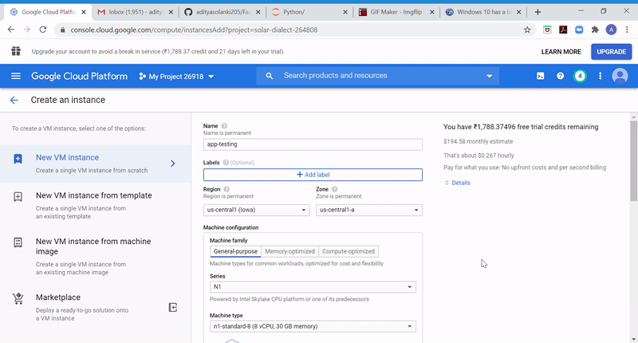
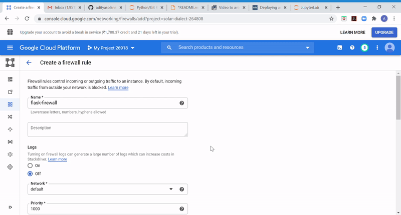
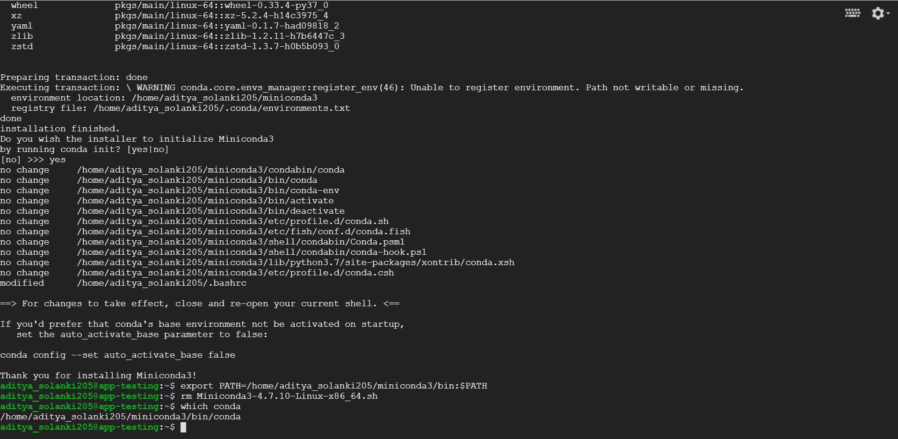
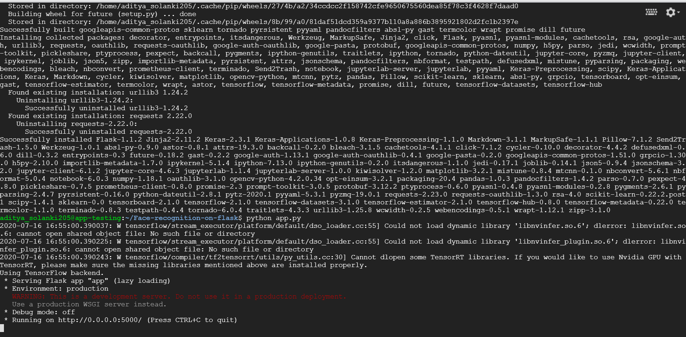
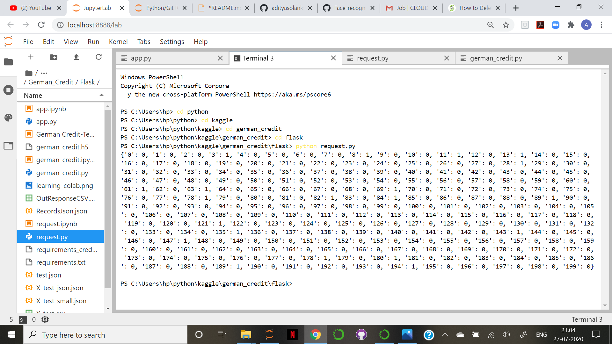

# Supervised Learning on German Credit Data

This is a **Supervised Learning Project on German Credit Data**.In this repository we will just implement this application using Flask Architecture to run it on Google Cloud. The complete process to Train and test is present [here](https://github.com/adityasolanki205/German-Credit).This model is trained to detect if the transaction is Fraud or not. In this repository a complete process of Supervised Learning is explained. This Repository is divided into 2 parts:

1. **Setting up the application on Google Cloud**
2. **Create a POST request to Detect Fraud Transactions**


## Motivation
For the last one year, I have been part of a great learning curve wherein I have upskilled myself to move into a Machine Learning and Cloud Computing. This project was practice project for all the learnings I have had. This is first of the many more to come. 
 

## Libraries/framework used

<b>Built with</b>
- [Pandas](https://pandas.pydata.org/)
- [numpy](https://numpy.org/)
- [Keras](https://keras.io/)
- [TensorFlow](https://www.tensorflow.org/)
- [scikit-learn](https://scikit-learn.org/stable/)
- [Flask](https://flask.palletsprojects.com/en/1.1.x/)


## Code Example

```bash
    # clone this repo, removing the '-' to allow python imports:
    git clone https://github.com/adityasolanki205/German-Credit-Using-Flask.git
```

## Installation

Below are the steps to setup the enviroment and run the codes:

1. **Cloud account Setup**: First we will have to setup free google cloud account which can be done [here](https://cloud.google.com/free). 

2. **Creating a Google Compute instance**: Now we have to create a Compute Engine Instance to deploy the app. To do that we will use **n1-standard-8** as it has larger processing power. For Boot Disk we will select **Ubuntu 18.04 LTS**. Also tick on the Allow Http traffic label to send/receive requests. At last create the instance.



3. **Create Firewall policy to allow Flask to access GCP**: For Local host to access google cloud we will have to
create a firewall rule to let port 5000 access Compute instance. To do that go to VPC/Firewall tool on google Console and create a new firewall rule.



4. **Deploying the App on Compute Engine**: After creating the instance, we will deploy the code on the instance using SSH. So click on the SSH button to create a session to deploy our code.

```bash
    # update system packages and install the required packages
    sudo apt-get update
    sudo apt-get install bzip2 libxml2-dev libsm6 libxrender1 libfontconfig1
    
    # clone the project repo
    git clone https://github.com/adityasolanki205/German-Credit-Using-Flask.git
    
    # download and install miniconda
    wget https://repo.anaconda.com/miniconda/Miniconda3-4.7.10-Linux-x86_64.sh
    bash Miniconda3-4.7.10-Linux-x86_64.sh
    
    export PATH=/home/<your name here>/miniconda3/bin:$PATH
    
    rm Miniconda3-4.7.10-Linux-x86_64.sh
    
    # confirm installation
    which conda
```


5. **Running the App**:  Now we will run the app on the instance

```bash
    # Goto the Flask Folder
    cd Face-recognition-on-flask
    
    # Installing all the dependencies
    pip install -r requirements.txt
    
    # Running the app 
    python app.py
```


6. **Creating a POST request from Local**: After this we will create a POST request from the local. To do that we will just run request.py from local. There is one thing that has to be changed in the request.py file i.e. the IP address of the instance. Copy the external IP of the instance from Google cloud Console and paste in the request.py file

```python
    import requests
    import json
    import cv2
    import PIL
    from PIL import Image , ImageDraw, ImageFont


    url = "http://<Your IP address>:5000/predict"
    headers = {"content-type": "image/jpg"}
    filename = 'images/singers.jpg'
```


6. **See the magic happen**: Run Request.py file and see Face recognition happening on Google Cloud. This will save a final.jpg file as an output image where all know faces will be boxed.


## Repository Content

    1. German Credit.ipynb

    2. German Credit.html
    
    3. German Credit-Tensorflow.ipynb

    2. German Credit-Tensorflow.html
    
    3. german.data    
    
    4. german.data-numeric
    
    5. german.doc
    

## Credits
1. Akash Nimare's [README.md](https://gist.github.com/akashnimare/7b065c12d9750578de8e705fb4771d2f#file-readme-md)
2. [Machine Learning Mastery](https://machinelearningmastery.com/imbalanced-classification-of-good-and-bad-credit/)
3. Special thanks to [Deploying ML Model](https://towardsdatascience.com/deploying-a-custom-ml-prediction-service-on-google-cloud-ae3be7e6d38f)
